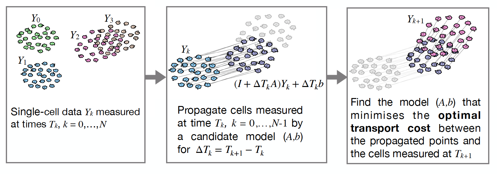

# GRIT

This repository contains the MATLAB implementation of GRIT (Gene Regulation Inference by Transport theory). It is introduced in the article

__F. Lamoline, I. Haasler, J. Karlsson, J. Goncalves__ and __A. Aalto__ "Gene regulatory network inference from single-cell data using optimal transport", [bioRxiv 2024.05.24.595731](https://www.biorxiv.org/content/10.1101/2024.05.24.595731v1.abstract), 2024.

## General information

GRIT requires time course single-cell data with preferably at least three time points. It fits a linear differential equation model that best fits the observed evolution over time. It propagates data measured at time _T__k_-1 using a candidate model. The propagated data is then compared to data measured at time _T__k_ using optimal transport. The candidate model producing smallest optimal transport cost is then determined. An additional variable selection step is performed to determine confidence levels on existence of regulations between genes.

## Basic use

When there are no perturbations in the dataset, GRIT is run by the command

`[GRN,A,transportMap] = GRIT(data,Tgrid,TFflag,branchId,opts);`

The different inputs and outputs are explained below.

### Inputs of GRIT

 - The expression data is given to GRIT in a cell array, so that `data{t}` contains the expression matrix corresponding to time point `t`. Each row of this matrix corresponds to a gene, and each column corresponds to a cell. In case several experiments are concatenated, the expression matrices are concatenated such that `data{t}` for _t=1,...,m1_ correspond to the first experiment, _t=m1+1,...,m1+m2_, to the second experiment, and so on. Multiple experiments are indicated by the measurement time input.
 
 - The measurement times are given in a vector `Tgrid`. In case of concatenated experiments, `Tgrid` should be a cell array such that `Tgrid{k}` contains the measurement times of the `k`th experiment.

For an example of GRIT on multiple experiments, see the last code section [here](realDataApplication/LRRK2_analysis.m). The following inputs can be left empty, but including branch indicators will improve performance if there are branching dynamics.

 - Transcription factor indicator `TFflag` should be a logical vector whose length is the number of genes in the data. This variable can be used to indicate which genes are transcription factors. Only the indicated transcription factors can then act as regulators. The variable can also be left empty. 

  - Branch indicator `branchId` should be a cell array with the same size as the `data` input. Each entry `branchId{t}` corresponds to time point `t` in the `data` input. It should be a matrix where each column corresponds to a cell in the corresponding expression data. The number of rows is the number of branches in the data. The matrix entries should be zeros and ones, where ones indicate to which branch the cell belongs to. Note that a cell can belong to multiple branches. See the section on branching dynamics below on how the branch indicators can be obtained using GRIT.

   - User-specified options can be given in the `opts` structure. If the user does not specify any options, default options are used. See the section "Options" below for details. Most importantly, method parallelisation is done using the options.

### Outputs of GRIT

 - The first output `GRN` gives the confidence values of existence of regulatory links. Each row corresponds to a target gene. In case of perturbation or mutation target inference, additional columns correspond to perturbations. In case the `TFflag` input is given, the `GRN` matrix will only have columns corresponding to the given TFs.

 - The second output `A` contains the dynamical model. The first columns correspond to the _A_-matrix in the differential equation, while the last columns correspond to vectors _b_ for different branches.

 - The transport plans are given in the third output `transportMap`, which is a cell array. The matrix `transportMap{t}` contains the transport plan for the time step _t_ -> _t_+1. Its number of rows is the number of columns in `data{t}` and the number of columns is the number of columns in `data{t+1}`.

## Example

The file `GRITexample.m` contains an example of running GRIT on data generated from the 10-dimensional nonlinear system used for validation.

## Use for inference of perturbation targets or mutation effects

To use the method for perturbation target inference, or finding the regulations affected by a mutation, GRIT is run as follows:

`[GRN,A,transportMap] = GRITpert(data,Tgrid,TFflag,branchId,perturbations,opts);`

The additional input `perturbations` is a data structure. The output matrix `GRN` will contain additional columns for the perturbation targets and mutation effects.

In case of perturbation target inference, this structure should contain a field `perturbations.Perturbation`, which is a cell array whose length is the number of experiments in the dataset (that is, `size(data,1)`). This cell array consists of indices of perturbations applied on the respective experiments. 

> __Example 1__
>
>Probably the most common setup is a case where one experiment corresponds to a control case, and another experiment corresponds to a perturbation. Then, the perturbation is given as follows:
>
>`perturbations.Perturbation = {[],[1]};`
>
> __Example 2__
>
>Say there are three experiments, where the first one is a control experiment, in the second experiment, perturbation A is applied, and on the third experiment, perturbations A and B are applied. This is given as follows:
>
>`perturbations.Perturbation = {[],[1],[1,2]};`

In case of mutation effect inference, the `perturbations` structure should contain a field `perturbations.Mutation`, which is a cell array whose length is the number of experiments in the dataset (that is, `size(data,1)`). This cell array consists of indices of mutated genes in the respective experiments. 

## Branching dynamics

In case of branching dynamics, method performance can be improved by indicating to which branch each cell belongs to. Branch indicators can be obtained, for example, from some pseudotime inference methods, but GRIT offers an alternative approach. This approach is based on a user-defined clustering of the final time point. The clusters should be indicated in a matrix `C` whose number of columns is the number of cells in the final time point, and the number of rows should be the number of clusters. GRIT should be first run without any cluster information as follows:

`[~,~,transportMap] = GRIT(data,Tgrid,[],[]);`

Then the branch labels can be obtained by

`branchId = branchLabeler(transportMap,C);`

Once the branch labels are created, the user can re-run GRIT with the cluster labels:

`[GRN,A,transportMap] = GRIT(data,Tgrid,[],branchId);`

## Options

The user can specify the following options using the `opts` structure:

 - `opts.epsilon` specifies the scaling of the entropy regularisation parameter (which then multiplies the median of the cost matrix to obtain the final regularisation parameter). Default is 0.05. A higher value increases stability in case of problems (if the method returns NaNs, or gives a warning about increased regularisation, it is advised to check the data for outliers rather than simply increasing regularisation).

 - `opts.iterations` specifies the number of iterations the method takes. Default is 30.

 - `opts.disp` specifies what information is shown as the method proceeds. Alternatives are `'off'`, `'basic'` indicating when the model selection step is complete, and `'all'` indicating the when each iteration is complete.

 - `opts.par` specifies the size of the parallel pool used within the method.

 - `opts.Nred` specifies the reduced dimension in which the optimal transport problem is solved. Default is 0.9 times the number of genes (rounded), but at most 100.

 - `opts.maxReg` specifies the maximum number of active regressors in the variable selection step. Default is 40.

 - `opts.branchWeight` specifies the penalty of having mass transport between branches. Default value is 2. A higher value will be more efficient in preventing, but it is discouraged, as it may cause stability issues.

 - `opts.signed` is a logical variable specifying whether the output matrix `GRN` is signed or not. The signs indicate whether the identified regulations are activations or inhibitions (the absolute values do not change based on this option).
  

## Reproduction of results presented in the article

The scripts for running the experiments whose results are presented in Sections 2.2-2.5 are in the folder "syntheticDataValidation". For the results of each section, there is one script that runs the experiment, including data generation.

The scripts for running the BEELINE validation pipeline are in the folder "BEELINEbenchmark". Note that the BEELINE data has to be downloaded from [Zenodo](https://doi.org/10.5281/zenodo.3701939) and copied to a proper folder. For reproducing the figures including results benchmarked in the BEELINE article, the source data files for figures 2, 4, and 5 need to be downloaded from the online publication [website](https://www.nature.com/articles/s41592-019-0690-6).

For running the analysis of the real data, the scripts are in the folder "realDataAnalysis".

The scripts for generating all figures in the article and the supplementary material can be found in the folder "paperFigures".
